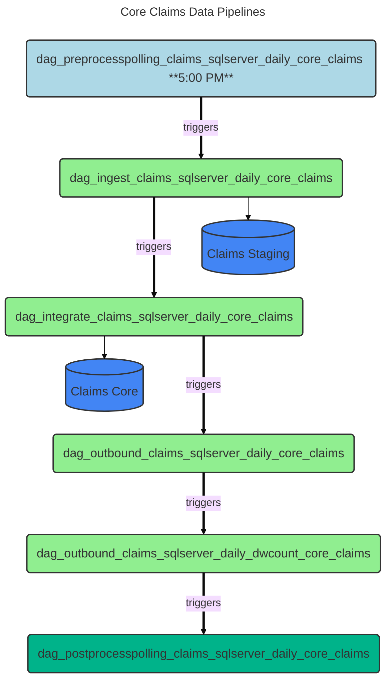

```mermaid
---
config:
  flowchart:
    defaultRenderer: "elk"
title: Core Claims Data Pipelines
---
%%{init: {'theme': 'base', 'themeVariables': { 'fontSize': '12pt' }}}%%
 graph TD
	classDef default fill:#90ee90;
	classDef start_dag fill:#add8e6;
	classDef end_dag fill:#00b38a;
	classDef bigquery fill:#4285f4;
	classDef default,start_dag,end_dag,bigquery stroke:#333,stroke-width:2px,font-size:14pt;

    Pre_Poll(dag_preprocesspolling_claims_sqlserver_daily_core_claims **5:00 PM**)
    Ingest(dag_ingest_claims_sqlserver_daily_core_claims)
    Integrate(dag_integrate_claims_sqlserver_daily_core_claims)
    Fact_Claim_Stats_Writeback(dag_outbound_claims_sqlserver_daily_core_claims)
    Core_Table_DW_Counts_Writeback(dag_outbound_claims_sqlserver_daily_dwcount_core_claims)
    Post_Poll(dag_postprocesspolling_claims_sqlserver_daily_core_claims)
	Staging[(Claims Staging)]
	Core[(Claims Core)]

    Pre_Poll == triggers ==> Ingest
	Ingest --> Staging
    Ingest == triggers ===> Integrate
	Integrate --> Core
    Integrate == triggers ===> Fact_Claim_Stats_Writeback
    Fact_Claim_Stats_Writeback == triggers ==> Core_Table_DW_Counts_Writeback
    Core_Table_DW_Counts_Writeback == triggers ==> Post_Poll
	
	class Pre_Poll start_dag
	class Post_Poll end_dag
	class Staging,Core bigquery
```