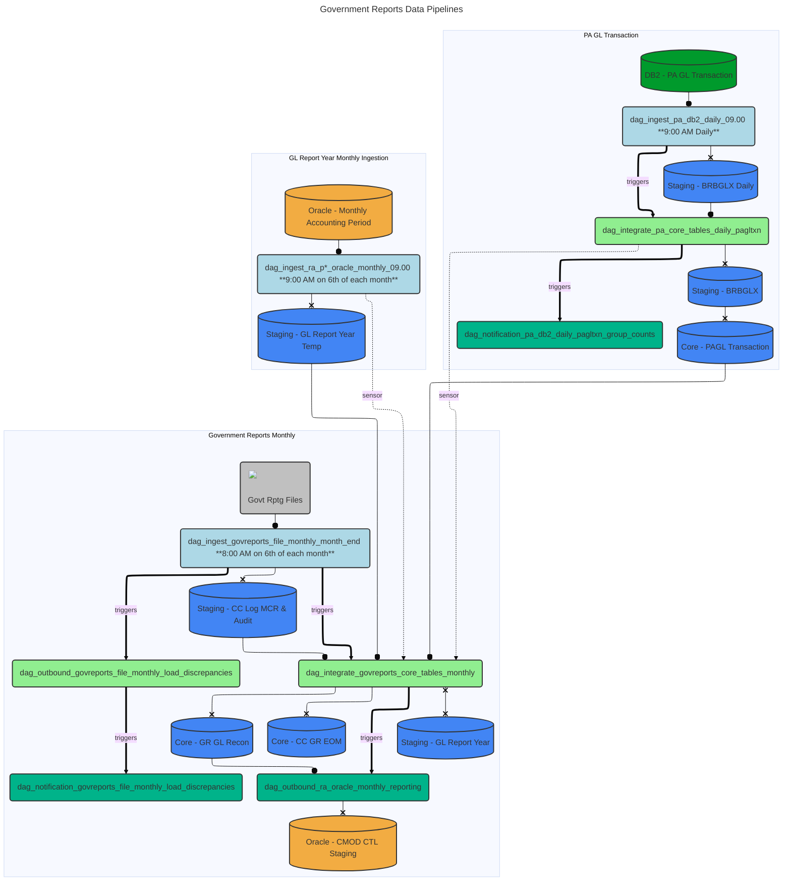

```mermaid
---
config:
  flowchart:
    defaultRenderer: "elk"
title: Government Reports Data Pipelines
---
%%{init: {'theme': 'base', 'themeVariables': { 'fontSize': '10pt' }}}%%
 graph TD
    classDef default fill:#90ee90;
    classDef start_dag fill:#add8e6;
    classDef end_dag fill:#00b38a;
    classDef bigquery fill:#4285f4;
    classDef oracle fill:#f2ac42;
    classDef db2 fill:#009a2c;
    classDef files fill:#c0c0c0;
    classDef default,start_dag,end_dag,bigquery,oracle stroke:#333,stroke-width:2px,font-size:12pt;

    PA_DB2_Staging[(DB2 - PA GL Transaction)]
    PAGL_Ingest(dag_ingest_pa_db2_daily_09.00 **9:00 AM Daily**)
    PAGL_Integrate(dag_integrate_pa_core_tables_daily_pagltxn)
    Stack_Updates_Notifications(dag_notification_pa_db2_daily_pagltxn_group_counts)
    GLX_Staging[(Staging - BRBGLX Daily)]
    Cumulative_GLX_Staging[(Staging - BRBGLX)]
    PAGL_Core[(Core - PAGL Transaction)]

    subgraph PA GL Transaction
    direction LR
    PA_DB2_Staging --o PAGL_Ingest --x GLX_Staging --o PAGL_Integrate
    PAGL_Ingest == triggers ===> PAGL_Integrate
    PAGL_Integrate --x Cumulative_GLX_Staging --x PAGL_Core
    PAGL_Integrate == triggers ===> Stack_Updates_Notifications
    end

    GL_Report_Year_Oracle_Source[(Oracle - Monthly Accounting Period)]
    GL_Report_Year_Ingest(dag_ingest_ra_p*_oracle_monthly_09.00 **9:00 AM on 6th of each month**)
    GL_Report_Year_Temp_Staging[(Staging - GL Report Year Temp)]

    subgraph GL Report Year Monthly Ingestion
    GL_Report_Year_Oracle_Source --o GL_Report_Year_Ingest --x GL_Report_Year_Temp_Staging
    end

    Govt_Rptg_Files(<img src='Files.png' width='30' height='50' /> Govt Rptg Files)
    Govt_File_Ingest(dag_ingest_govreports_file_monthly_month_end **8:00 AM on 6th of each month**)
    Govt_Integrate(dag_integrate_govreports_core_tables_monthly)
    CMOD_CTL_STG(dag_outbound_ra_oracle_monthly_reporting)
    Discrepancy_Generation(dag_outbound_govreports_file_monthly_load_discrepancies)
    Discrepancy_Reporting(dag_notification_govreports_file_monthly_load_discrepancies)
    Govt_Staging[(Staging - CC Log MCR & Audit)]
    GL_Report_Year_Staging[(Staging - GL Report Year)]
    CC_GR_EOM_Core[(Core - CC GR EOM)]
    GR_GL_Core[(Core - GR GL Recon)]
    CMOD_CTL_Staging[(Oracle - CMOD CTL Staging)]

    subgraph Government Reports Monthly
    Govt_Rptg_Files --o Govt_File_Ingest --x Govt_Staging
    Govt_File_Ingest == triggers ===> Govt_Integrate & Discrepancy_Generation
    Discrepancy_Generation == triggers ===> Discrepancy_Reporting
    Govt_Staging & GL_Report_Year_Temp_Staging & PAGL_Core --o Govt_Integrate
    Govt_Integrate x--x GL_Report_Year_Staging
    Govt_Integrate --x CC_GR_EOM_Core & GR_GL_Core
    Govt_Integrate == triggers ===> CMOD_CTL_STG
    GR_GL_Core --o CMOD_CTL_STG --x CMOD_CTL_Staging
    end

    PAGL_Integrate -. sensor .-> Govt_Integrate
    GL_Report_Year_Ingest -. sensor .-> Govt_Integrate

    class Govt_File_Ingest,PAGL_Ingest,GL_Report_Year_Ingest start_dag
    class Stack_Updates_Notifications,CMOD_CTL_STG,Discrepancy_Reporting end_dag
    class GLX_Staging,Cumulative_GLX_Staging,PAGL_Core bigquery
    class GL_Report_Year_Temp_Staging,GL_Report_Year_Staging bigquery
    class Govt_Staging,CC_GR_EOM_Core,GR_GL_Core bigquery
    class PA_DB2_Staging db2
    class CMOD_CTL_Staging,GL_Report_Year_Oracle_Source oracle
    class Govt_Rptg_Files files
```