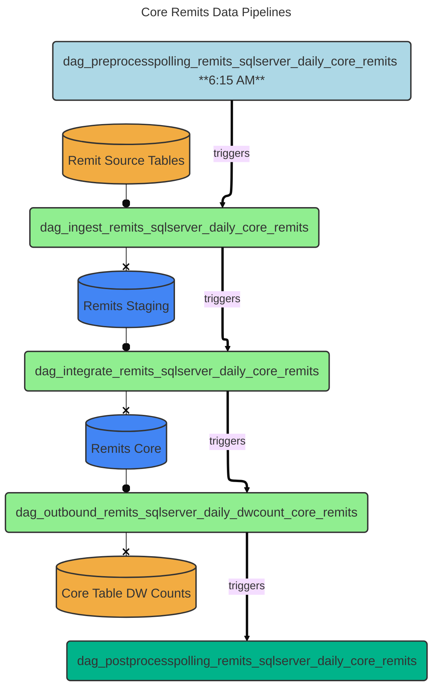

```mermaid
---
config:
  flowchart:
    defaultRenderer: "elk"
title: Core Remits Data Pipelines
---
%%{init: {'theme': 'base', 'themeVariables': { 'fontSize': '12pt' }}}%%
 graph TD
	classDef default fill:#90ee90;
	classDef start_dag fill:#add8e6;
	classDef end_dag fill:#00b38a;
	classDef bigquery fill:#4285f4;
	classDef sqlserver fill:#f2ac42;
	classDef default,start_dag,end_dag,bigquery,sqlserver stroke:#333,stroke-width:2px,font-size:14pt;

    Pre_Poll(dag_preprocesspolling_remits_sqlserver_daily_core_remits **6:15 AM**)
    Ingest(dag_ingest_remits_sqlserver_daily_core_remits)
    Integrate(dag_integrate_remits_sqlserver_daily_core_remits)
    Core_Table_DW_Counts_Writeback(dag_outbound_remits_sqlserver_daily_dwcount_core_remits)
    Post_Poll(dag_postprocesspolling_remits_sqlserver_daily_core_remits)
    Remits_Source[(Remit Source Tables)]
	Remits_Staging[(Remits Staging)]
	Remits_Core[(Remits Core)]
    DW_Counts_Writeback[(Core Table DW Counts)]

    Pre_Poll == triggers ==> Ingest == triggers ===> Integrate == triggers ===> Core_Table_DW_Counts_Writeback == triggers ==> Post_Poll
	Remits_Source --o Ingest --x Remits_Staging --o Integrate --x Remits_Core --o Core_Table_DW_Counts_Writeback --x DW_Counts_Writeback
	
	class Pre_Poll start_dag
	class Post_Poll end_dag
	class Remits_Staging,Remits_Core bigquery
	class Remits_Source,DW_Counts_Writeback sqlserver
```