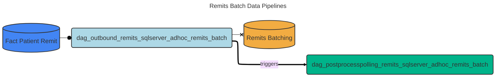

```mermaid
---
config:
  flowchart:
    defaultRenderer: "elk"
title: Remits Batch Data Pipelines
---
%%{init: {'theme': 'base', 'themeVariables': { 'fontSize': '12pt' }}}%%
 graph LR
	classDef default fill:#90ee90;
	classDef start_dag fill:#add8e6;
	classDef end_dag fill:#00b38a;
	classDef bigquery fill:#4285f4;
	classDef sqlserver fill:#f2ac42;
	classDef default,start_dag,end_dag,bigquery,sqlserver stroke:#333,stroke-width:2px,font-size:14pt;

    Remits_Batching_Writeback(dag_outbound_remits_sqlserver_adhoc_remits_batch)	
    Fact_Remits_Core[(Fact Patient Remit)]
    Post_Poll(dag_postprocesspolling_remits_sqlserver_adhoc_remits_batch)
    Batching_Writeback[(Remits Batching)]

    Fact_Remits_Core --o Remits_Batching_Writeback --x Batching_Writeback
    Remits_Batching_Writeback == triggers ==> Post_Poll
	
	class Remits_Batching_Writeback start_dag
	class Post_Poll end_dag
	class Batching_Writeback sqlserver
	class Fact_Remits_Core bigquery
```