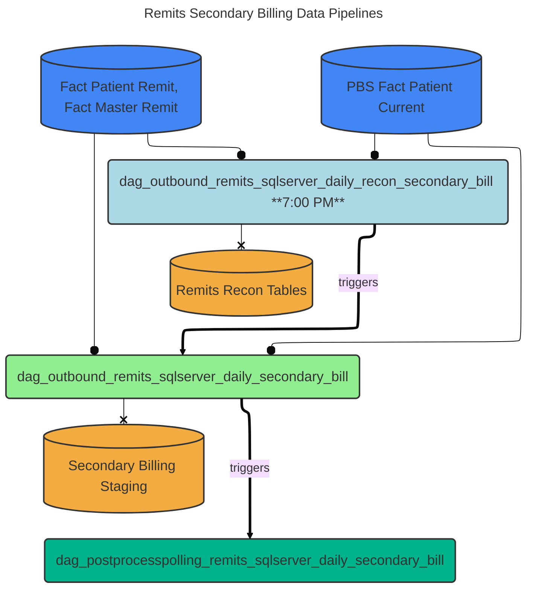

```mermaid
---
config:
  flowchart:
    defaultRenderer: "elk"
title: Remits Secondary Billing Data Pipelines
---
%%{init: {'theme': 'base', 'themeVariables': { 'fontSize': '12pt' }}}%%
 graph TD
	classDef default fill:#90ee90;
	classDef start_dag fill:#add8e6;
	classDef end_dag fill:#00b38a;
	classDef bigquery fill:#4285f4;
	classDef sqlserver fill:#f2ac42;
	classDef default,start_dag,end_dag,sqlserver stroke:#333,stroke-width:2px,font-size:14pt;

  Remits_Recon_Writeback(dag_outbound_remits_sqlserver_daily_recon_secondary_bill **7:00 PM**)
  Remits_Secondary_Billing_Writeback(dag_outbound_remits_sqlserver_daily_secondary_bill)
  Post_Poll(dag_postprocesspolling_remits_sqlserver_daily_secondary_bill)
  Fact_Remits_Core[(Fact Patient Remit, Fact Master Remit)]
  Fact_Patient_Current_Core[(PBS Fact Patient Current)]
  Recon_Writeback[(Remits Recon Tables)]
  Secondary_Billing_Writeback[(Secondary Billing Staging)]

  Remits_Recon_Writeback == triggers ==> Remits_Secondary_Billing_Writeback == triggers ==> Post_Poll
  Fact_Remits_Core & Fact_Patient_Current_Core --o Remits_Recon_Writeback --x Recon_Writeback
  Fact_Remits_Core & Fact_Patient_Current_Core --o Remits_Secondary_Billing_Writeback --x Secondary_Billing_Writeback
	
	class Remits_Recon_Writeback start_dag
	class Post_Poll end_dag
	class Recon_Writeback,Secondary_Billing_Writeback sqlserver
	class Fact_Remits_Core,Fact_Patient_Current_Core bigquery
```